# Converse — Enterprise Conversational AI Platform

> A production-grade, multi-tenant SaaS platform for creating, deploying, managing, monitoring, and optimizing conversational AI agents powered by Dialogflow CX and Large Language Models.

## Architecture Overview

```mermaid
graph TB
    subgraph "Client Layer"
        FE["Next.js Frontend"]
        SDK["Client SDKs"]
        WEB["Web Widget"]
    end

    subgraph "Edge Layer"
        GW["API Gateway<br/>Service #20"]
    end

    subgraph "Core Services"
        AUTH["Auth Service<br/>#1"]
        USER["User Service<br/>#2"]
        ORG["Org Service<br/>#3"]
        AGENT["Agent Mgmt<br/>#4"]
        DFCX["Dialogflow CX<br/>#5"]
        CONV["Conversation<br/>#6"]
        WF["Workflow Engine<br/>#7"]
        WH["Webhook Engine<br/>#8"]
        KB["Knowledge Base<br/>#9"]
        LLM["LLM Gateway<br/>#10"]
        PROMPT["Prompt Mgmt<br/>#11"]
        ANALYTICS["Analytics<br/>#12"]
        NOTIF["Notification<br/>#13"]
        AUDIT["Audit<br/>#14"]
        BILLING["Billing<br/>#15"]
        ADMIN["Admin<br/>#16"]
        VOICE["Voice GW<br/>#17"]
        CHANNEL["Channel GW<br/>#18"]
        SEARCH["Search<br/>#19"]
    end

    subgraph "Data Layer"
        PG["PostgreSQL + pgvector"]
        RD["Redis"]
        KF["Kafka"]
        S3["S3 / GCS"]
    end

    subgraph "Observability"
        OT["OpenTelemetry"]
        PR["Prometheus"]
        GR["Grafana"]
    end

    FE --> GW
    SDK --> GW
    WEB --> GW
    GW --> AUTH & USER & ORG & AGENT & DFCX & CONV
    GW --> WF & WH & KB & LLM & PROMPT
    GW --> ANALYTICS & NOTIF & AUDIT & BILLING & ADMIN
    GW --> VOICE & CHANNEL & SEARCH
    AUTH & USER & ORG --> PG
    AGENT & CONV & KB --> PG
    LLM & PROMPT & ANALYTICS --> PG
    CONV & LLM --> RD
    CONV & WF --> KF
    KB --> S3
    AUTH & USER & ORG --> OT
    AGENT & CONV --> OT
```



## Project Structure

```
converse-ai-platform/
├── README.md
├── CONTRIBUTING.md
├── LICENSE
├── Makefile
├── docker-compose.yml
├── docker-compose.dev.yml
├── docker-compose.test.yml
├── .env.example
├── .gitignore
├── .github/
│   └── workflows/
│       ├── ci.yml
│       ├── cd.yml
│       └── security.yml
│
├── docs/
│   ├── architecture/
│   │   ├── overview.md
│   │   ├── adr/                          # Architecture Decision Records
│   │   ├── diagrams/
│   │   └── api-contracts/
│   └── guides/
│       ├── development.md
│       ├── deployment.md
│       └── onboarding.md
│
├── infrastructure/
│   ├── terraform/
│   │   ├── modules/
│   │   ├── environments/
│   │   └── main.tf
│   ├── kubernetes/
│   │   ├── base/
│   │   ├── overlays/
│   │   └── helm/
│   └── monitoring/
│       ├── prometheus/
│       ├── grafana/
│       └── alertmanager/
│
├── packages/                              # Shared libraries
│   ├── shared-kernel/                     # DDD shared kernel
│   │   ├── pyproject.toml
│   │   └── src/
│   │       └── converse_shared/
│   │           ├── __init__.py
│   │           ├── domain/
│   │           │   ├── __init__.py
│   │           │   ├── base_entity.py
│   │           │   ├── aggregate_root.py
│   │           │   ├── value_objects.py
│   │           │   ├── domain_events.py
│   │           │   └── repository.py
│   │           ├── application/
│   │           │   ├── __init__.py
│   │           │   ├── command.py
│   │           │   ├── query.py
│   │           │   ├── use_case.py
│   │           │   └── dto.py
│   │           ├── infrastructure/
│   │           │   ├── __init__.py
│   │           │   ├── database.py
│   │           │   ├── cache.py
│   │           │   ├── messaging.py
│   │           │   ├── event_bus.py
│   │           │   └── unit_of_work.py
│   │           ├── security/
│   │           │   ├── __init__.py
│   │           │   ├── jwt_handler.py
│   │           │   ├── rbac.py
│   │           │   ├── tenant_context.py
│   │           │   └── pii_masker.py
│   │           ├── observability/
│   │           │   ├── __init__.py
│   │           │   ├── tracing.py
│   │           │   ├── metrics.py
│   │           │   ├── logging.py
│   │           │   └── correlation.py
│   │           ├── middleware/
│   │           │   ├── __init__.py
│   │           │   ├── correlation_id.py
│   │           │   ├── tenant_middleware.py
│   │           │   ├── rate_limiter.py
│   │           │   ├── error_handler.py
│   │           │   └── request_logging.py
│   │           └── config/
│   │               ├── __init__.py
│   │               └── settings.py
│   │
│   └── proto/                             # Protobuf / gRPC definitions
│       └── converse/
│           ├── common.proto
│           ├── auth.proto
│           ├── agent.proto
│           └── conversation.proto
│
├── services/                              # Microservices
│   ├── auth-service/                      # Service #1
│   ├── user-service/                      # Service #2
│   ├── org-service/                       # Service #3
│   ├── agent-service/                     # Service #4
│   ├── dialogflow-service/                # Service #5
│   ├── conversation-service/              # Service #6
│   ├── workflow-service/                  # Service #7
│   ├── webhook-service/                   # Service #8
│   ├── knowledge-base-service/            # Service #9
│   ├── llm-gateway/                       # Service #10
│   ├── prompt-service/                    # Service #11
│   ├── analytics-service/                 # Service #12
│   ├── notification-service/              # Service #13
│   ├── audit-service/                     # Service #14
│   ├── billing-service/                   # Service #15
│   ├── admin-service/                     # Service #16
│   ├── voice-gateway/                     # Service #17
│   ├── channel-gateway/                   # Service #18
│   ├── search-service/                    # Service #19
│   └── api-gateway/                       # Service #20
│
├── frontend/                              # Next.js application
│   ├── package.json
│   ├── tsconfig.json
│   ├── next.config.ts
│   ├── tailwind.config.ts
│   └── src/
│       ├── app/
│       ├── components/
│       ├── lib/
│       ├── hooks/
│       ├── stores/
│       └── types/
│
├── scripts/
│   ├── seed.py
│   ├── migrate.py
│   ├── setup-dev.sh
│   └── generate-keys.sh
│
└── tests/
    ├── e2e/
    ├── integration/
    ├── load/
    └── contract/
```

---

## Phased Implementation Plan

Given the enormous scope, this project will be built in **5 phases**. Each phase delivers a working, deployable increment.

---

## Phase 1 — Foundation & Core Platform (Services 1-4, 14, 20)

> **Goal**: Establish the shared kernel, infrastructure, and core identity/org/agent management. The platform should be runnable with `docker-compose up`.

### 1.1 Shared Kernel (`packages/shared-kernel`)

The shared kernel is the foundation every service depends on. It implements DDD, Clean Architecture, and Hexagonal Architecture patterns.

#### [NEW] `packages/shared-kernel/pyproject.toml`
- Package metadata, dependencies (FastAPI, SQLAlchemy 2.0, Pydantic v2, redis, confluent-kafka, opentelemetry-sdk, prometheus-client, structlog)

#### [NEW] `packages/shared-kernel/src/converse_shared/domain/`
| File | Purpose |
|------|---------|
| `base_entity.py` | `BaseEntity` with UUID id, created_at, updated_at, soft-delete |
| `aggregate_root.py` | `AggregateRoot` extends BaseEntity, tracks domain events |
| `value_objects.py` | `TenantId`, `UserId`, `Email`, `Money`, `Pagination`, `TimeRange` |
| `domain_events.py` | `DomainEvent` base, `EventBus` interface, `EventHandler` |
| `repository.py` | `Repository[T]` generic interface with CRUD + query specs |
| `exceptions.py` | `DomainException`, `EntityNotFound`, `BusinessRuleViolation`, `ConcurrencyConflict` |
| `specification.py` | Specification pattern for composable query filters |

#### [NEW] `packages/shared-kernel/src/converse_shared/application/`
| File | Purpose |
|------|---------|
| `command.py` | `Command` base class, `CommandHandler` interface |
| `query.py` | `Query` base class, `QueryHandler` interface |
| `use_case.py` | `UseCase` abstract class with execute/validate lifecycle |
| `dto.py` | `BaseDTO`, `PaginatedResponse`, `ApiResponse` wrapper |
| `mediator.py` | In-process mediator for CQRS command/query dispatch |

#### [NEW] `packages/shared-kernel/src/converse_shared/infrastructure/`
| File | Purpose |
|------|---------|
| `database.py` | SQLAlchemy 2.0 async engine/session factory, tenant-aware session |
| `cache.py` | Redis client wrapper with serialization, tenant-scoped keys |
| `messaging.py` | Kafka producer/consumer with Avro/JSON schema support |
| `event_bus.py` | `EventBus` implementation (in-process + Kafka) |
| `unit_of_work.py` | `UnitOfWork` pattern with SQLAlchemy session + event dispatch |
| `health.py` | Health check registry (DB, Redis, Kafka) |

#### [NEW] `packages/shared-kernel/src/converse_shared/security/`
| File | Purpose |
|------|---------|
| `jwt_handler.py` | JWT encode/decode, RS256, token refresh, claims extraction |
| `rbac.py` | Role, Permission, policy engine, `@require_permission` decorator |
| `tenant_context.py` | `TenantContext` async context var, tenant resolution |
| `pii_masker.py` | Regex + NER PII detection and masking |
| `api_key.py` | API key generation, hashing, validation |

#### [NEW] `packages/shared-kernel/src/converse_shared/observability/`
| File | Purpose |
|------|---------|
| `tracing.py` | OpenTelemetry tracer provider, span decorators |
| `metrics.py` | Prometheus metrics: counters, histograms, gauges |
| `logging.py` | structlog config: JSON, correlation ID, tenant context |
| `correlation.py` | Correlation ID middleware, propagation via headers |

#### [NEW] `packages/shared-kernel/src/converse_shared/middleware/`
| File | Purpose |
|------|---------|
| `correlation_id.py` | Extract/generate `X-Correlation-ID`, inject into context |
| `tenant_middleware.py` | Extract tenant from JWT/header, set `TenantContext` |
| `rate_limiter.py` | Token bucket + sliding window via Redis |
| `error_handler.py` | Global exception handler → structured error responses |
| `request_logging.py` | Log request/response with latency, status, tenant |
| `auth_middleware.py` | JWT validation, user extraction, permission check |

---

### 1.2 Auth Service (`services/auth-service/`)

Each microservice follows this internal structure:

```
auth-service/
├── Dockerfile
├── pyproject.toml
├── alembic.ini
├── alembic/
│   └── versions/
├── src/
│   └── auth_service/
│       ├── __init__.py
│       ├── main.py                    # FastAPI app factory
│       ├── config/
│       │   ├── __init__.py
│       │   └── settings.py            # Pydantic Settings
│       ├── domain/
│       │   ├── __init__.py
│       │   ├── entities/
│       │   │   ├── user_credentials.py
│       │   │   ├── refresh_token.py
│       │   │   ├── api_key.py
│       │   │   └── oauth_connection.py
│       │   ├── value_objects/
│       │   │   ├── password.py        # Hashed password VO
│       │   │   └── token_pair.py
│       │   ├── events/
│       │   │   ├── user_authenticated.py
│       │   │   └── token_revoked.py
│       │   ├── repositories/
│       │   │   └── credential_repository.py   # Interface
│       │   └── services/
│       │       └── auth_domain_service.py
│       ├── application/
│       │   ├── __init__.py
│       │   ├── commands/
│       │   │   ├── login.py
│       │   │   ├── register.py
│       │   │   ├── refresh_token.py
│       │   │   ├── logout.py
│       │   │   ├── create_api_key.py
│       │   │   └── revoke_api_key.py
│       │   ├── queries/
│       │   │   ├── validate_token.py
│       │   │   └── list_api_keys.py
│       │   └── dto/
│       │       ├── auth_request.py
│       │       └── auth_response.py
│       ├── infrastructure/
│       │   ├── __init__.py
│       │   ├── persistence/
│       │   │   ├── models.py          # SQLAlchemy ORM models
│       │   │   ├── credential_repo_impl.py
│       │   │   └── migrations/
│       │   ├── external/
│       │   │   └── oauth_provider.py  # Google, GitHub OAuth
│       │   └── cache/
│       │       └── token_cache.py     # Redis token blacklist
│       ├── api/
│       │   ├── __init__.py
│       │   ├── v1/
│       │   │   ├── __init__.py
│       │   │   ├── router.py
│       │   │   ├── auth_controller.py
│       │   │   ├── api_key_controller.py
│       │   │   └── schemas.py         # Pydantic request/response
│       │   └── dependencies.py        # FastAPI DI
│       └── exceptions/
│           ├── __init__.py
│           └── auth_exceptions.py
└── tests/
    ├── unit/
    │   ├── test_auth_domain_service.py
    │   └── test_password_vo.py
    ├── integration/
    │   └── test_auth_api.py
    └── conftest.py
```

**Key Endpoints**:
| Method | Path | Description |
|--------|------|-------------|
| POST | `/api/v1/auth/register` | Register user (org admin or invited) |
| POST | `/api/v1/auth/login` | Login → JWT + refresh token |
| POST | `/api/v1/auth/refresh` | Refresh access token |
| POST | `/api/v1/auth/logout` | Revoke refresh token |
| POST | `/api/v1/auth/oauth/{provider}` | OAuth2 login (Google, GitHub) |
| POST | `/api/v1/auth/api-keys` | Create API key |
| GET | `/api/v1/auth/api-keys` | List API keys |
| DELETE | `/api/v1/auth/api-keys/{id}` | Revoke API key |
| GET | `/api/v1/auth/me` | Current user from token |

---

### 1.3 User Service (`services/user-service/`)

**Domain Entities**: `User`, `UserProfile`, `UserPreferences`, `UserRole`

**Key Endpoints**:
| Method | Path | Description |
|--------|------|-------------|
| GET | `/api/v1/users` | List users (paginated, filtered) |
| GET | `/api/v1/users/{id}` | Get user |
| PUT | `/api/v1/users/{id}` | Update user |
| DELETE | `/api/v1/users/{id}` | Deactivate user |
| GET | `/api/v1/users/{id}/roles` | Get user roles |
| PUT | `/api/v1/users/{id}/roles` | Assign roles |
| POST | `/api/v1/users/invite` | Invite user to org |

---

### 1.4 Organization Service (`services/org-service/`)

**Domain Entities**: `Organization`, `Project`, `Environment`, `OrganizationMember`, `Invitation`, `OrganizationSettings`

**Key Endpoints**:
| Method | Path | Description |
|--------|------|-------------|
| POST | `/api/v1/organizations` | Create org |
| GET | `/api/v1/organizations/{id}` | Get org |
| PUT | `/api/v1/organizations/{id}` | Update org |
| POST | `/api/v1/organizations/{id}/projects` | Create project |
| GET | `/api/v1/organizations/{id}/projects` | List projects |
| POST | `/api/v1/organizations/{id}/members` | Add member |
| GET | `/api/v1/organizations/{id}/members` | List members |
| POST | `/api/v1/organizations/{id}/environments` | Create environment |
| GET | `/api/v1/organizations/{id}/settings` | Get settings |

---

### 1.5 Agent Management Service (`services/agent-service/`)

**Domain Entities**: `Agent`, `AgentVersion`, `AgentConfig`, `AgentDeployment`, `AgentChannel`

**Key Endpoints**:
| Method | Path | Description |
|--------|------|-------------|
| POST | `/api/v1/agents` | Create agent |
| GET | `/api/v1/agents` | List agents |
| GET | `/api/v1/agents/{id}` | Get agent |
| PUT | `/api/v1/agents/{id}` | Update agent |
| POST | `/api/v1/agents/{id}/versions` | Create version |
| POST | `/api/v1/agents/{id}/deploy` | Deploy agent to env |
| GET | `/api/v1/agents/{id}/deployments` | List deployments |
| POST | `/api/v1/agents/{id}/test` | Test agent in sandbox |

---

### 1.6 Audit Service (`services/audit-service/`)

**Domain Entities**: `AuditLog`, `AuditPolicy`

High-throughput, append-only service. Receives events via Kafka. Provides query API.

---

### 1.7 API Gateway (`services/api-gateway/`)

FastAPI-based gateway with:
- Route registration for all services
- JWT validation
- Rate limiting
- Request/response transformation
- Circuit breaker
- Service discovery
- API versioning
- CORS

---

### 1.8 Infrastructure

#### [NEW] `docker-compose.yml`
Services: PostgreSQL, Redis, Kafka + Zookeeper, MinIO (S3), Prometheus, Grafana, Jaeger

#### [NEW] `docker-compose.dev.yml`
Override for local dev: hot-reload, debug ports, volume mounts

#### [NEW] `Makefile`
Targets: `setup`, `up`, `down`, `migrate`, `seed`, `test`, `lint`, `build`

#### [NEW] `scripts/seed.py`
Seed data: default org, admin user, sample agent, roles/permissions

---

## Phase 2 — Conversational AI Core (Services 5, 6, 9, 10, 11)

> **Goal**: Integrate Dialogflow CX, build conversation handling, knowledge base with RAG, and LLM gateway.

### 2.1 Dialogflow CX Integration Service (`services/dialogflow-service/`)

**Domain**: `DialogflowAgent`, `Flow`, `Page`, `Intent`, `Entity`, `TransitionRoute`, `Fulfillment`

- Full CRUD for Dialogflow CX resources via Google Cloud API
- Sync between platform agents and Dialogflow CX agents
- Environment management (draft, staging, production)
- Version management and rollback
- Webhook configuration
- Test case management

### 2.2 Conversation Service (`services/conversation-service/`)

**Domain**: `Conversation`, `Message`, `Session`, `ConversationContext`, `TurnEvent`

- Real-time messaging via WebSocket
- Session management with Redis
- Conversation memory (short-term Redis, long-term PostgreSQL)
- Context management across turns
- Human handoff escalation
- Conversation export
- Conversation replay

### 2.3 Knowledge Base Service (`services/knowledge-base-service/`)

**Domain**: `KnowledgeBase`, `Article`, `Document`, `Chunk`, `Embedding`

- Document ingestion (PDF, DOCX, HTML, Markdown)
- Chunking strategies (fixed, semantic, recursive)
- Embedding generation via Vertex AI / OpenAI
- Vector storage in pgvector
- RAG pipeline: retrieve → rerank → augment
- Knowledge base versioning

### 2.4 LLM Gateway (`services/llm-gateway/`)

**Domain**: `LLMProvider`, `LLMRequest`, `LLMResponse`, `ModelConfig`, `UsageRecord`

- Unified interface for multiple LLM providers
- Vertex AI / Gemini integration
- OpenAI-compatible API support
- Anthropic-compatible API support
- Streaming support (SSE)
- Token counting and cost tracking
- Rate limiting per tenant
- Fallback routing between providers
- Response caching

### 2.5 Prompt Management Service (`services/prompt-service/`)

**Domain**: `PromptTemplate`, `PromptVersion`, `PromptVariable`, `PromptExecution`

- Prompt CRUD with Jinja2/Mustache templating
- Version control with diff
- A/B testing support
- Variable validation
- Execution history
- Prompt library (shared across org)

---

## Phase 3 — Workflow, Channels & Integrations (Services 7, 8, 17, 18)

### 3.1 Workflow Engine (`services/workflow-service/`)
- Visual workflow builder support
- Approval workflows
- Condition/branch nodes
- Action nodes (API call, LLM, Dialogflow)
- Stateful execution via saga pattern

### 3.2 Webhook Engine (`services/webhook-service/`)
- Inbound/outbound webhook management
- Signature verification (HMAC)
- Retry with exponential backoff
- Event filtering
- Delivery logs

### 3.3 Voice Gateway (`services/voice-gateway/`)
- Telephony integration
- Speech-to-text / text-to-speech
- Call routing
- DTMF support

### 3.4 Channel Gateway (`services/channel-gateway/`)
- WhatsApp Business API
- Slack Bot
- Microsoft Teams
- Telegram Bot
- Web Widget (embeddable)
- Email
- Unified message format

---

## Phase 4 — Intelligence & Analytics (Services 12, 13, 15, 19)

### 4.1 Analytics Service
- Conversation analytics
- Intent performance
- Agent performance
- Channel metrics
- CSAT tracking
- Custom reports

### 4.2 Notification Service
- Multi-channel notifications (email, Slack, webhook)
- Notification templates
- Subscription management

### 4.3 Billing Service
- Usage-based billing
- Plan management
- Invoice generation
- Cost monitoring per org/agent

### 4.4 Search Service
- Full-text search via PostgreSQL
- Semantic search via pgvector
- Search across conversations, knowledge bases, agents

---

## Phase 5 — Frontend & Admin (Service 16, Frontend)

### 5.1 Admin Service (`services/admin-service/`)
- Platform admin dashboard
- Tenant management
- System health
- Feature flags

### 5.2 Frontend (`frontend/`)
Next.js 14+ with App Router, TypeScript, TailwindCSS, shadcn/ui

**Pages**:
| Route | Page |
|-------|------|
| `/` | Landing / Login |
| `/dashboard` | Overview dashboard |
| `/conversations` | Conversation inbox |
| `/agents` | Agent management |
| `/agents/[id]/builder` | Agent flow builder |
| `/knowledge` | Knowledge base |
| `/prompts` | Prompt library |
| `/workflows` | Workflow builder |
| `/analytics` | Analytics dashboard |
| `/channels` | Channel configuration |
| `/integrations` | Third-party integrations |
| `/settings` | Org settings |
| `/settings/team` | Team management |
| `/settings/billing` | Billing & usage |
| `/settings/api-keys` | API key management |
| `/admin` | Platform admin (super-admin) |

---

## User Review Required

> [!IMPORTANT]
> **Scope Management**: This platform has 20 microservices, a full frontend, and extensive infrastructure. Building everything at production quality will take significant time. I recommend we start with **Phase 1** (foundation + core services 1-4, 14, 20) to establish patterns, then iterate.

> [!IMPORTANT]
> **Database Strategy**: Should each microservice have its own PostgreSQL database (true microservice isolation), or should we use a shared database with schema-per-service for Phase 1 simplicity?

> [!WARNING]
> **External Dependencies**: Services 5 (Dialogflow CX), 10 (LLM Gateway), and 17 (Voice Gateway) require real GCP/API credentials. Phase 1 will include mock/stub implementations. Should I also create a `.env.example` with all required environment variables documented?

## Open Questions

1. **Phase 1 Scope Confirmation**: Should I proceed with Phase 1 only (Shared Kernel + Services 1, 2, 3, 4, 14, 20 + Docker infrastructure), or do you want a different grouping?

2. **gRPC vs REST for inter-service**: Should inter-service communication use REST (simpler) or gRPC (higher performance)? I recommend REST for Phase 1 with gRPC as a future optimization.

3. **Auth Provider**: Should the Auth Service implement its own JWT-based auth entirely, or should it delegate to an identity provider (Auth0, Firebase Auth, Keycloak)?

4. **Frontend Priority**: Should the frontend be included in Phase 1, or should we focus on backend + API-first approach and add the frontend in Phase 5?

5. **Testing Strategy**: Full TDD (test-first) vs comprehensive tests written alongside code? TDD will be slower but higher quality.

---

## Verification Plan

### Automated Tests
```bash
# Per-service unit tests
make test-unit SERVICE=auth-service

# Integration tests (requires Docker)
make test-integration

# Full test suite
make test-all

# Linting
make lint
```

### Manual Verification
- `docker-compose up` starts all Phase 1 services
- API Gateway routes requests correctly
- Auth flow: register → login → get token → access protected endpoints
- Multi-tenant isolation: Org A cannot access Org B data
- Swagger UI accessible at each service's `/docs` endpoint
- Prometheus metrics at `/metrics`
- Health checks at `/health`
- Structured JSON logs with correlation IDs

### Load Testing
- k6 scripts for auth endpoints
- Verify rate limiting under load
- Verify tenant isolation under concurrent requests
